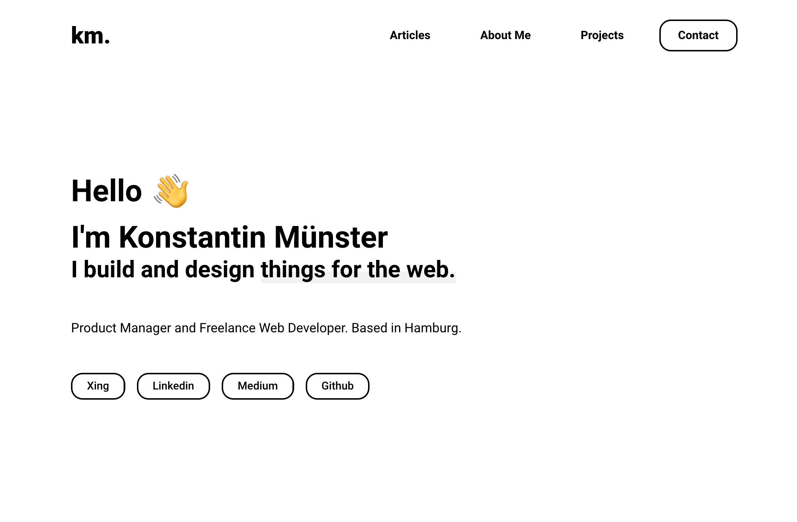

# Gatsby Portfolio
#### My personal website - Built with [Gatsby.js](https://www.gatsbyjs.org/) and Published at [konstantin.digital](https://konstantin.digital)
[](https://opensource.org/licenses/MIT) [](https://app.netlify.com/sites/fervent-hamilton-17c92d/deploys)

This is the first iteration of my personal website. The project is under ongoing development. However, feel free to use it as a basis for your own portfolio - please just read the note below first. And if you find any bugs or improvements, let me know!



## Note
I've made my portfolio open source for your inspiration. I think, especially for beginners, it can be hard to get a first starting point. So feel free to build your portfolio up on mine. However, if you do so, please leave a tiny hint on your site that links to my site [konstantin.digital](https://konstantin.digital) or this [GitHub project](https://github.com/konstantinmuenster/gatsby-portfolio). Thanks and happy coding!

## Installation
If you don't already have the Gatsby CLI, install it

  ```npm install -g gatsby-cli```

Clone the project and change directory accordingly

  ```git clone https://github.com/konstantinmuenster/gatsby-portfolio.git```
  
  ```cd portfolio-gatsby```

Install it

  ```npm install```

Run development server and enjoy

  ```gatsby develop```

## About

Konstantin Münster – [konstantin.digital](https://konstantin.digital) – [mail@konstantin.digital](mailto:mail@konstantin.digital)

Distributed under the [MIT](http://showalicense.com/?fullname=Konstantin+M%C3%BCnster&year=2019#license-mit) license. 
See ``LICENSE`` for more information.

[https://github.com/konstantinmuenster](https://github.com/konstantinmuenster)
